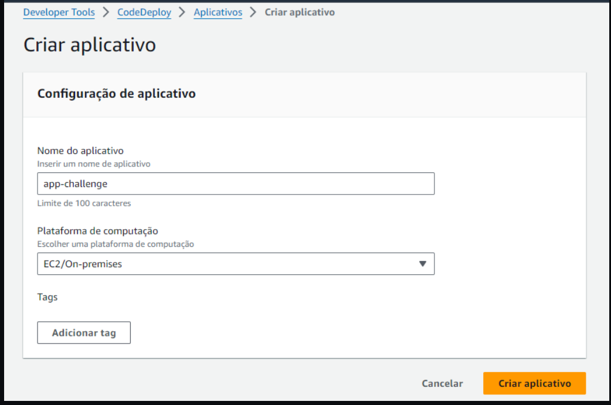
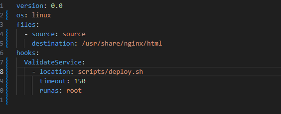

# DevOps Challenge

## Descrição

O processo de automação CI/CD na AWS EC2, através de uma pipeline integrada com GitHub Actions, será composto pelo AWS CodePipeline e AWS CodeDeploy. Esse processo será iniciado automaticamente após commits e push no repositório GitHub.

GitHub Actions será configurado para disparar automaticamente em push para o branch principal, acionando o início do pipeline. O AWS CodePipeline integrará o repositório GitHub com o AWS CodeDeploy, coordenando todo o fluxo de entrega contínua.

O AWS CodeDeploy será responsável por automatizar o deployment na instância EC2, garantindo a eficiência e a confiabilidade no processo de atualização contínua da aplicação. Com essa configuração, o processo de deployment se torna mais ágil e seguro, minimizando riscos e reduzindo o tempo de inatividade.

### Tecnologias Utilizadas
 
- Github
- GitHub Actions
- Terraform
- CodeDeploy
- CodePipeline
- EC2 

## Diagrama da Solução

  

## Instruções

## 1 - Subindo a Infraestrutua

**1.** Para começar, é essencial ter acesso à plataforma AWS para gerenciar seus recursos na nuvem de forma eficiente.

**2.** Crie um usuário na AWS e gere "Secret Keys" para acesso seguro aos recursos AWS via linha de comando. É recomendado não compartilhar essas "Secret Keys" para manter a segurança dos seus dados.

    - Selecione as políticas apropriadas, como AmazonEC2FullAccess, AmazonVPCFullAccess, ou crie uma política personalizada com as permissões necessárias para seu projeto.

    - Criar um Bucket que servirá como um backend e armazenara o arquivo terraform.state gerado

**3.** Instale a AWS CLI na sua máquina. A AWS CLI permite interagir com os serviços da AWS de maneira simplificada e automatizada diretamente do terminal.

link p/ Instalação: [AWS CLI](https://docs.aws.amazon.com/cli/latest/userguide/getting-started-install.html).

**4.** Garanta que o Terraform esteja instalado na sua máquina para gerenciar sua infraestrutura como código na AWS. O Terraform simplifica o provisionamento e a automação de recursos na AWS de forma declarativa e escalável

link p/ Instalação : [terraform](https://developer.hashicorp.com/terraform/tutorials/aws-get-started/install-cli#install-cli)

**5.   No seu terminal configurar as Secrets Keys do seu usuario**

    - aws configure

**5. Configurar as variaveis para o Deploy na infraestrutra no arquivo variables.tf na raiz do projeto**

  

  - Observação : Por questões de segurança , e evitar de ter a chave.pem para acessar a instancia no repositorio e recomendado criar a chave .pem na console e adicionar o nome da chave no campo variable "key_pair"

**6. Inicar o terraform via linha de comando** 

    - terraform init

**7. Verificar se todos os recursos estão subindo corretamente**

    - terraform plan

**8. Caso tudo estiver ok conforme configurado iremos implantar a infraestrtura como codigo** 

    - terraform apply

## 2 - Piipeline CI/CD

**1. GitHub Repositório (Push)**
Após realizar alterações no código-fonte da aplicação , fazer o commit para o repositório GitHub.

**2. GitHub Actions (Trigger)**
GitHub Actions é configurado para monitorar o repositório em busca de alterações no branch principal(main)

Configuração: No diretório .github/workflows/main.yaml, ira definir a pipeline de CI/CD.

**3. Criar AWS code Deploy**

Configuração: Para configurar o CodeDeploy, você precisa de três coisas: o aplicativo CodeDeploy, o grupo de implantação do aplicativo e uma função do IAM que o CodeDeploy pode assumir para acessar as instâncias do EC2.

  **Criar um aplicativo:**
    
  Navegue até o Console do CodeDeploy, no painel esquerdo, clique em “ Aplicativos ” na seção “Implementar” e selecione “Criar aplicativo”.

  

  Em seguida, forneça o nome do seu aplicativo e use a plataforma “ EC2/On-premises ”.

  #Criar função do IAM do CodeDeploy#

  Vá para a seção IAM e crie uma nova função

  

  Use “ AWS Service ” para entidade confiável e selecione “ CodeDeploy ” no menu suspenso para “Caso de uso”.

  Clique em Avançar e use a política “AWSCodeDeployRole” anexada.

  

  Dê um nome à função e salve.

  **Criar um grupo de implantação**

  Vá para o aplicativo que você criou anteriormente e clique em “Criar grupo de implantação”.

  Forneça um nome para seu grupo de implantação e selecione a função que criamos anteriormente para a função de serviço.

  Você pode deixar o tipo de implantação nas configurações padrão. Selecione “Amazon EC2 instances” para alvos e use tags para identificá-los.

  

  Selecione “ Nunca” na configuração do agente, instalaremos o agente CodeDeploy será instalado no user data da ec2 implantada pelo terraform

  Você pode selecionar a configuração de implantação “OneAtATime” e habilitar o balanceamento de carga se tiver mais de uma instância , caso contrário, desmarque a opção de balanceamento de carga.

  Em seguida, clique no botão criar grupo de implantação.

**4. Trigger para o CodeDeploy**

  **arquivo: appspec.yml**

  o arquivo appspec.yml , localizado na raiz do repositorio informará o CodeDeploy Agent sobre os comandos que você deseja executar durante a implantação

    

    - colocar nome do repositorio

  **arquivos: start_server.sh e set-permissions.sh dentro da pasta script**

  Irão inicializar o servidor e setar permissões para o repositorio

**5. Criar Code Pipeline**

  ir em Code Pipeline > criar Pipeline

  

  Adicionar repositorio , precisara autenticar ao github 

  

  Adicionar a branch

  

  No acionador manter essas configurações

  

  Ignorar etapa de compilação

  

  Etapa de implantação , selecionar o CodeDeploy como provedor , Nome do aplicativo eo Grupo de implantação

  

  Proximo , revisar e criar pipeline

**6. Criar Bucket S3**

    O Bucket servira como um repositorio interno da pipeline

**Criando Bucket**

**Desmarcar Bloquear todo acesso público**

**Ativar Versionamento**

**Criar pasta dentro do bucket**

**7. Trigger Github Actions**

  **arquivo github/workflows/main.yaml** 

  

        - //Criar variaveis no repositorio , conforme as chave Secreta do usuario//

        - aws_access_key: ${{ secrets.AWS_ACCESS_KEY }} 
        - aws_secret_key: ${{ secrets.AWS_SECRET_KEY }} 

        - aws_region: us-east-1
        - codedeploy_name: app-challenge  //Nome da aplicação criado
        - codedeploy_group: group-app-challenge  // Nome do Grupo de Implantação
        - s3_bucket: s3-app-challenge01  // Nome do bucket
        - s3_folder: deploy // nome da pasta que ficará dentro do bucket

        - e descomentar : o bloco  #push: /#branches:main

será disparado após modificação do repositorio

>  This is a challenge by [Coodesh](https://coodesh.com/)

